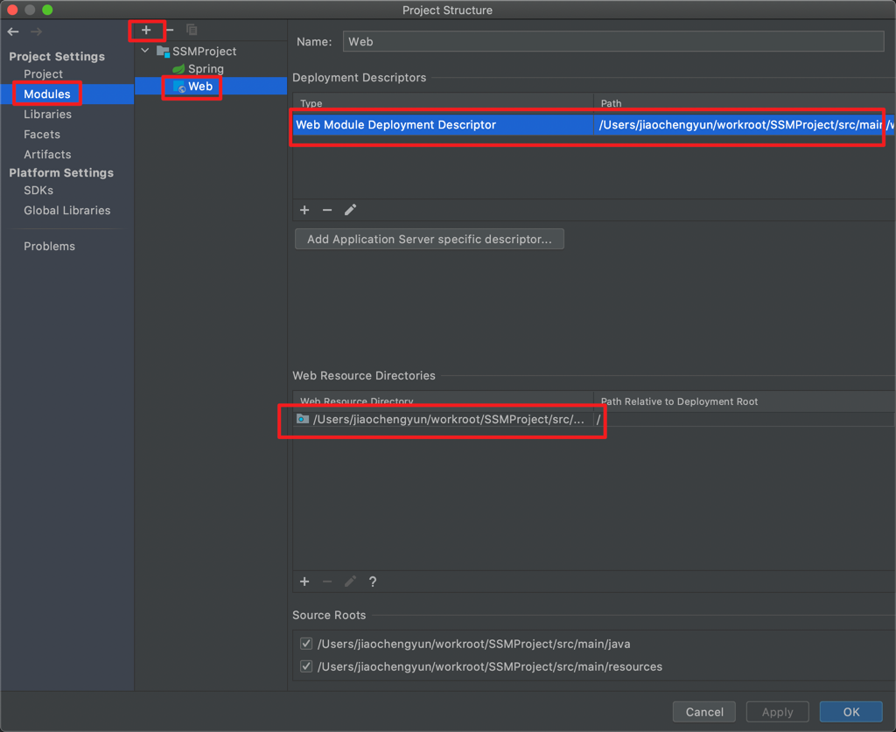
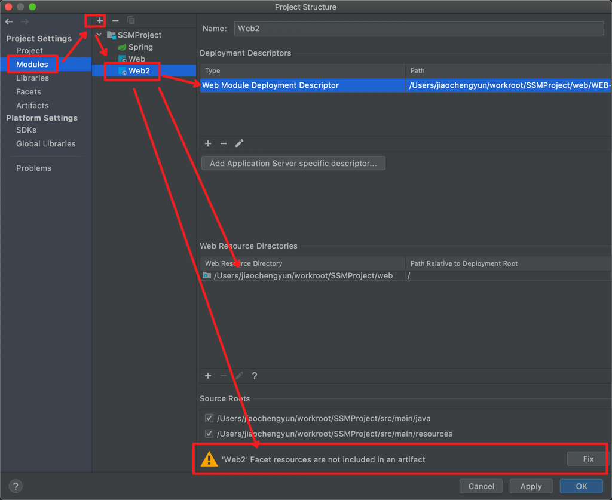
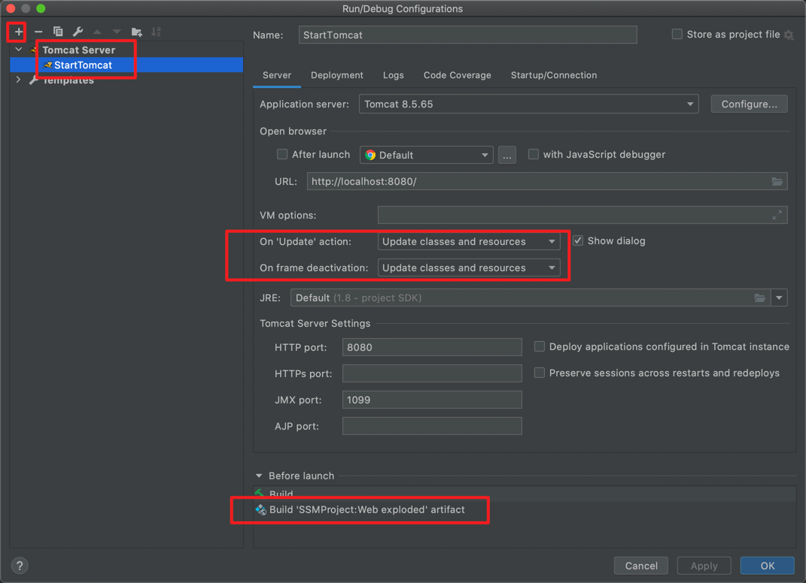
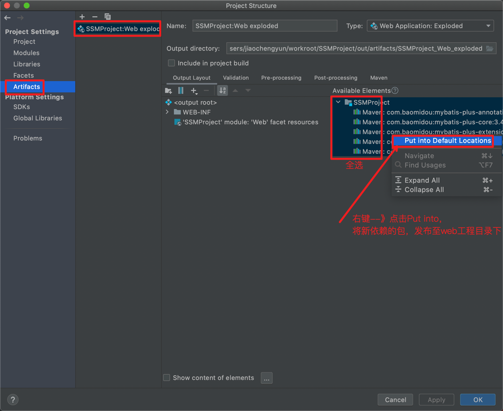
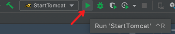

# SSMProject

## 配置
1. 创建Maven工程
2. pom.xml --》 导入spring + spring mvc + mybatis
3. File --》 Project Structure --》 Modules --》+ --》Web --》创建Web项目，配置webapp路径(默认webapp与src同级目录，可切换至与java和resources目录同级) 
4. Fix --》Facet resources are not included in an artifact --》点击Fix 
   
   Artifact 是maven中的一个概念，表示某个module要如何打包。 例如war exploded、war、jar、ear等等这种打包形式；
   Artifact 多模块概念。一个module有了 Artifacts 就可以部署到应用服务器中了！

   带不带exploded的差别：explode 在这里你可以理解为展开，不压缩的意思。也就是war、jar等产出物没压缩前的目录结构。
   建议在开发的时候使用这种模式，便于修改了文件的效果立刻显现出来。
5. 配置Tomcat目录 --》Edit Configurations --》—+ --》Tomcat Server --》Local --》配置80端口或者默认的8080端口 --》Artifact配置 
6. 将导入的新包发布--》File --》 Project Structure --》 Artifacts（每次添加新依赖均需要发布至web目录） 
7. 运行：Run "xxxTomcat" --》
## 运行
1. 注意每次修改运行时out是否更新，有时修改不生效是因为out不更新导致。

### 解决idea web项目中out目录更新不同步问题
1. build->Build Artifact->clean,然后再build->build Artifact->rebuild
2. 如果使用的是maven构建的web项目，就简单很多直接cmd定位到项目根节点，有pom.xml那个路径下，mvn clean，mvn install。